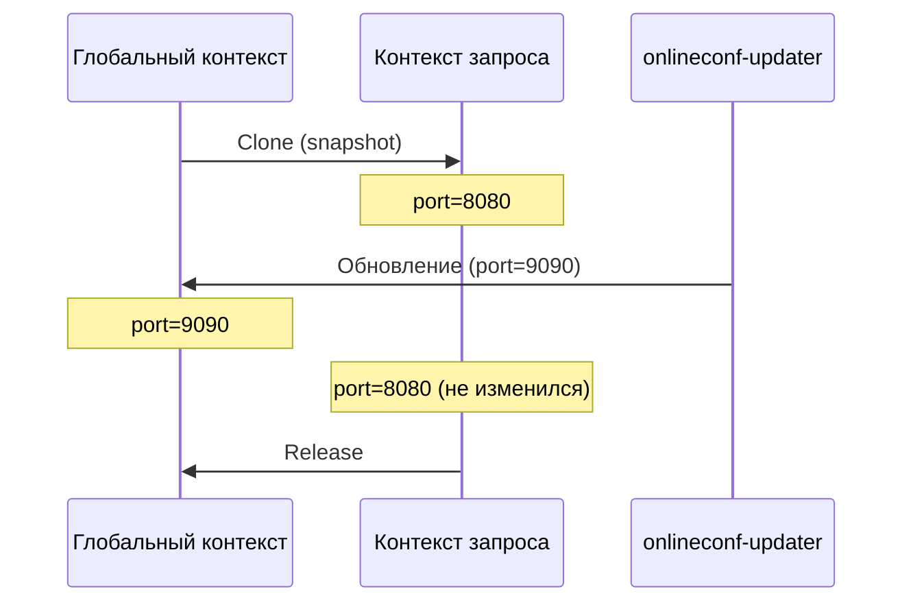

# Clone/Release

## Зачем нужен Clone

В daemon-приложениях (HTTP-серверы, воркеры) конфигурация может измениться в середине обработки запроса. Чтобы гарантировать консистентность конфигурации на протяжении всего запроса, используется механизм `Clone`/`Release`.

## Как это работает



**Clone** создаёт readonly-копию текущего состояния конфигурации. Клонированный экземпляр:

- Читает те же CDB-данные, что были на момент клонирования
- Не обновляется при изменении файлов
- Не может регистрировать модули и подписки
- Не может запускать watcher

**Release** освобождает ресурсы клонированного экземпляра и уменьшает refcount mmap-файлов.

!!! danger "Обязательно вызывайте Release"
    Если не вызвать `Release`, mmap-файлы не будут освобождены, что приведёт к утечке памяти.

## Пример использования

### В HTTP-сервере

```go
var globalCtx context.Context

func init() {
    globalCtx, _ = onlineconf.Initialize(context.Background())
    onlineconf.StartWatcher(globalCtx)
}

func handler(w http.ResponseWriter, r *http.Request) {
    // Создаём snapshot конфигурации для запроса
    reqCtx, err := onlineconf.Clone(globalCtx, r.Context())
    if err != nil {
        http.Error(w, "config error", 500)
        return
    }
    defer onlineconf.Release(globalCtx, reqCtx)

    // Конфигурация стабильна на протяжении всего запроса
    name, _ := onlineconf.GetString(reqCtx, "/app/name")
    // ...
}
```
