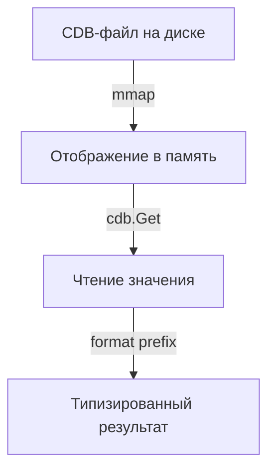

# Модули и CDB

## Формат CDB

Конфигурация хранится в файлах формата [CDB (Constant Database)](https://cr.yp.to/cdb.html) — быстрой key-value базе с O(1) поиском.

Каждый модуль — это один CDB-файл (например, `TREE.cdb`). По умолчанию файлы располагаются в `/usr/local/etc/onlineconf`.

## Формат значений

Значения в CDB хранятся с однобайтовым префиксом формата:

| Префикс | Тип | Описание |
|---|---|---|
| `s` | string | UTF-8 строка |
| `j` | JSON | JSON-значение (массивы, объекты) |
| пустые данные | — | Параметр не существует |

## Модули

По умолчанию используется модуль `TREE` (файл `TREE.cdb`). Можно работать с несколькими модулями:

```go
// Получить существующий модуль
module := instance.GetModule("module1")

// Получить или создать модуль
module, err := instance.GetOrAddModule("module1")

// Чтение из модуля
val, err := module.GetString("/param/path")
```

## Memory-Mapped I/O

CDB-файлы открываются через `mmap` для эффективного чтения без копирования в userspace.



## Кэширование

Модуль кэширует результаты `GetStrings` и `GetStruct` (десериализованные значения). Кэш сбрасывается при `Reopen` модуля (обновлении CDB-файла).

## Reference Counting

Экземпляр `OnlineconfInstance` отслеживает mmap-файлы по адресу указателя. При клонировании refcount увеличивается, при Release или Reopen — уменьшается. Когда refcount достигает 0, mmap-файл закрывается.
