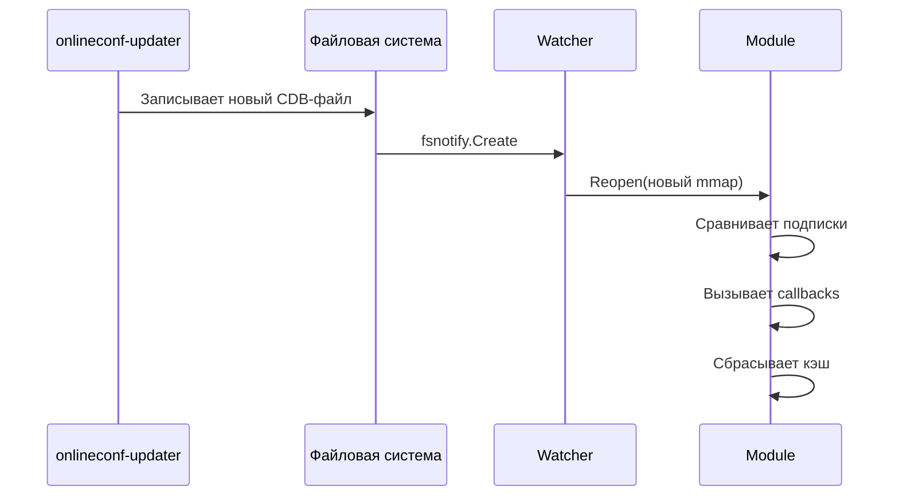

# Watcher и подписки

## Автообновление конфигурации

`go-onlineconf` использует [fsnotify](https://github.com/fsnotify/fsnotify) для отслеживания изменений CDB-файлов. Когда `onlineconf-updater` записывает новый файл, watcher автоматически перечитывает конфигурацию.

!!! note "Важно"
    `onlineconf-updater` атомарно заменяет файлы (create, а не write), поэтому watcher отслеживает событие `fsnotify.Create`.

## Запуск и остановка

```go
ctx, _ := onlineconf.Initialize(context.Background())

// Запуск watcher (создаёт горутину)
err := onlineconf.StartWatcher(ctx)

// ... приложение работает, конфигурация обновляется автоматически ...

// Остановка watcher
onlineconf.StopWatcher(ctx)
```

!!! warning "Readonly-экземпляры"
    Watcher нельзя использовать в клонированных (readonly) экземплярах. Watcher работает только на основном экземпляре.

## Подписки на изменения

Можно подписаться на изменения конкретных параметров. Callback вызывается при обновлении CDB-файла, если отслеживаемые параметры изменились.

```go
params := []string{"/app/feature_flag", "/app/rate_limit"}
callback := func() error {
    // Обработка изменения
    log.Println("Конфигурация обновлена")
    return nil
}

err := onlineconf.RegisterSubscription(ctx, "TREE", params, callback)
```

### Поведение подписок

| Значение `params` | Поведение |
|---|---|
| `nil` | Callback вызывается при любом изменении модуля |
| `[]string{""}` | Callback вызывается при любом изменении модуля |
| `[]string{"/path1", "/path2"}` | Callback вызывается если `/path1` или `/path2` изменились |

## Процесс обновления


