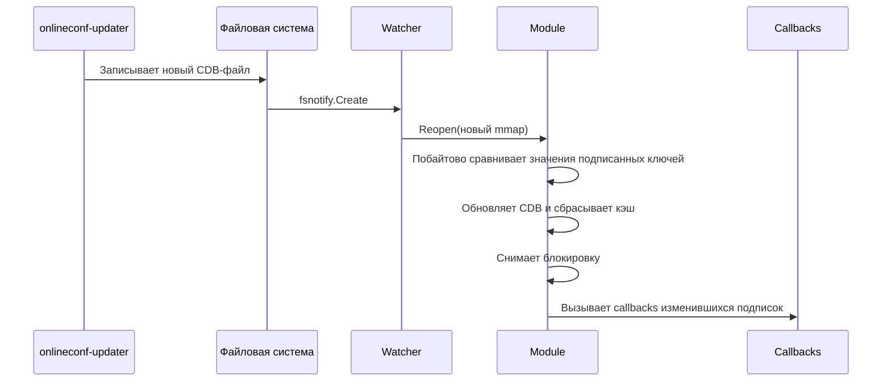

# Watcher и подписки

## Автообновление конфигурации

`go-onlineconf` использует [fsnotify](https://github.com/fsnotify/fsnotify) для отслеживания изменений CDB-файлов. Когда `onlineconf-updater` записывает новый файл, watcher автоматически перечитывает конфигурацию.

!!! note "Важно"
    `onlineconf-updater` атомарно заменяет файлы (create, а не write), поэтому watcher отслеживает событие `fsnotify.Create`.

## Запуск и остановка

```go
ctx, _ := onlineconf.Initialize(context.Background())

// Запуск watcher (создаёт горутину)
err := onlineconf.StartWatcher(ctx)

// ... приложение работает, конфигурация обновляется автоматически ...

// Остановка watcher
onlineconf.StopWatcher(ctx)
```

!!! warning "Readonly-экземпляры"
    Watcher нельзя использовать в клонированных (readonly) экземплярах. Watcher работает только на основном экземпляре.

## Подписки на изменения

Можно подписаться на изменения конкретных параметров. Callback вызывается при обновлении CDB-файла **только если** отслеживаемые параметры действительно изменились.

```go
params := []string{"/app/feature_flag", "/app/rate_limit"}
callback := func() error {
    // Обработка изменения
    log.Println("Конфигурация обновлена")
    return nil
}

err := onlineconf.RegisterSubscription(ctx, "TREE", params, callback)
```

### Поведение подписок

| Значение `params` | Поведение |
|---|---|
| `nil` | Callback вызывается при **любом** реопене модуля |
| `[]string{""}` | Callback вызывается при **любом** реопене модуля |
| `[]string{"/path1", "/path2"}` | Callback вызывается если `/path1` **или** `/path2` изменились |

### Алгоритм детектирования изменений

При `Reopen` для каждой подписки с конкретными путями выполняется побайтовое сравнение значений в старом и новом CDB:

```
Для каждого пути в подписке:
  1. Прочитать значение из нового CDB и из старого CDB
  2. Если состояние ошибки изменилось (ключ появился/исчез) → изменение
  3. Если оба чтения вернули ошибку → пропустить путь
  4. Сравнить байтовое содержимое (bytes.Equal) → если отличается, изменение
  5. При первом обнаруженном изменении — добавить callback и прервать проверку
```

Ключевые гарантии:

- **Callback вызывается максимум один раз** за реопен, даже если подписка отслеживает несколько путей и все они изменились
- **Callback НЕ вызывается**, если ни один из отслеживаемых путей не изменился (даже если другие ключи в модуле изменились)
- Сравнение происходит на уровне сырых байтов CDB-значений (включая префикс формата `s`/`j`)
- Callbacks вызываются **после** обновления состояния модуля и снятия блокировки — внутри callback можно безопасно читать конфигурацию

### Множественные подписки

На один модуль можно зарегистрировать несколько независимых подписок. Каждая проверяется и срабатывает независимо:

```go
// Подписка 1 — сработает только при изменении rate_limit
onlineconf.RegisterSubscription(ctx, "TREE", []string{"/app/rate_limit"}, func() error {
    log.Println("rate limit changed")
    return nil
})

// Подписка 2 — сработает только при изменении feature_flag
onlineconf.RegisterSubscription(ctx, "TREE", []string{"/app/feature_flag"}, func() error {
    log.Println("feature flag changed")
    return nil
})
```

!!! warning "Ошибки в callbacks"
    Если callback возвращает ошибку, она логируется, но не прерывает вызов остальных callbacks.

## Процесс обновления


