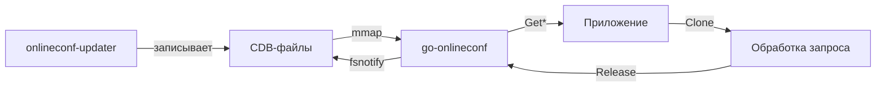

# go-onlineconf

Go-клиент для чтения конфигурационных файлов, генерируемых [onlineconf-updater](https://github.com/onlineconf/onlineconf#onlineconf-updater).

## Возможности

| Возможность | Описание |
|---|---|
| **CDB + mmap** | Чтение конфигурации из индексированных CDB-файлов через memory-mapped I/O |
| **Автообновление** | Watcher на базе fsnotify автоматически перечитывает файлы при изменении |
| **Типизированный доступ** | Геттеры для String, Int, Bool, Duration, []String, Struct (JSON) |
| **Модули** | Поддержка нескольких конфигурационных модулей (по умолчанию — TREE) |
| **Подписки** | Callback-уведомления при изменении конкретных параметров |
| **Clone/Release** | Снимок конфигурации для обработки запроса — значения не меняются в процессе |
| **Два API** | Context-based API и Instance API на выбор |

## Как это работает



## Быстрый пример

```go
// Инициализация через контекст
ctx, err := onlineconf.Initialize(context.Background())

// Чтение значений
name, err := onlineconf.GetString(ctx, "/app/name")
port, err := onlineconf.GetInt(ctx, "/app/port", 8080)
debug, err := onlineconf.GetBool(ctx, "/app/debug", false)
timeout, err := onlineconf.GetDuration(ctx, "/app/timeout", 5*time.Second)
```
